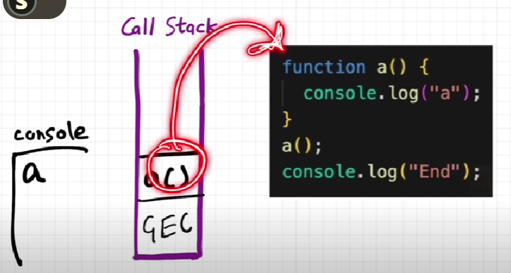
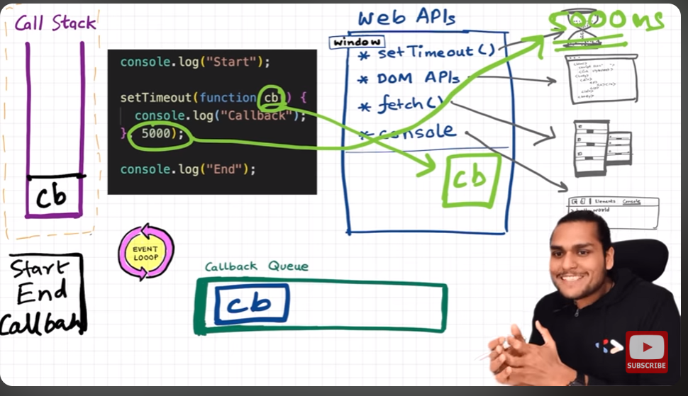

 Browser have a lots of super power , like access to location , netflix servers , localstorage , timer(set time out ) , https/ call , communicate with the server , its the most remarkable creation 🫠.
  So to access the all super power functionality we need *** WEB API *** . 
***SETTIMEOUT*** , *** DOM API***  , *** CONSOLE.LOG()***   these are all part of web apis .




```javascript

console.log("start");
setTimeout(function cbt() {
console.log("callback timer ")
},5000);

 fetch("http://api.netflix.com").then(function cbF(){
    console.log("Call back netflix data");
 });
 //1000000 lines of code 

 console.log("end");

```


lets discuss the output of the code , this code will print like ->

```javascript

start 
end 
call back netflix data 
callback timer 


```

 lets see how , 
  
1. GEC is created , and as per js it executes line by line , and console.log will print *** "start" ***
2. now settimeout using bowser api , Js engine attach a timer into it , and start 5 s timer
3. now by browser it start fetch  netflix servers data.
4. runs the millions lines of code by js GEC  main thread , it takes time .
5. console.log will print *** "end" ***
6. GEC pops out from call stack
7. meanwhile netflix data comes , and wait at micro task queue 
8. meanwhile settimeout ended its 5sec timer and  wait at call back queue , wait for its turn .
9. but micro task queue have higher priority than call back queue
10. event loop it check the call stack is empty or not , it empty then it take what ever in micro task queue , and give its chance to execute. so *** "call back netflix data " ***will print 
11. now after pops , event loop again check the call stack is empty or not , and check at micro task queue if its also empty or not , now it will give turn the callback queue to execute himself. and it will print *** "call back timer" ***